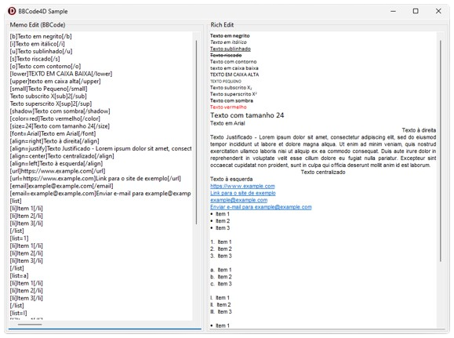

<a name="readme-top"></a>


<a href="https://linkedin.com/in/weslley-capelari"></a>
# BBCode4D: Convert BBCode to Rich Text in Delphi

<br />
<div align="center">
    <a href="https://github.com/weslleycapelari/BBCode4D">
        
    </a>
    <h3 align="center">BBCode4D</h3>
    <p align="center">
        A Delphi library for converting BBCode to Rich Text Format (RTF).
        <br />
        <a href="https://github.com/weslleycapelari/BBCode4D"><strong>Explore the code »</strong></a>
        <br />
        <br />
        <a href="https://github.com/weslleycapelari/BBCode4D/sample">View Demo</a>
        ·
        <a href="https://github.com/weslleycapelari/BBCode4D/issues">Report Bug</a>
        ·
        <a href="https://github.com/weslleycapelari/BBCode4D/issues">Request Feature</a>
    </p>
</div>

## About The Project

**BBCode4D** is a Delphi library that allows you to easily convert BBCode markup to RTF, which can be displayed in a `TRichEdit` component. This is ideal for applications where users need to format text with basic formatting options like bold, italics, lists, and links.

Currently, the library supports converting BBCode to RTF. The reverse functionality (RTF to BBCode) is planned for future development.

<div align="center">
    <a href="https://github.com/weslleycapelari/BBCode4D">
        
    </a>
</div>

## Getting Started

### Prerequisites

* Delphi (tested with Delphi 12)

### Installation

There are two ways to install BBCode4D:
1. **Include** the `BBCode4D.pas` file: Simply add the `BBCode4D.pas` file to your project and include it in your uses clause.

2. **Use Boss:** If you're using the Boss package manager for Delphi, you can install BBCode4D by running the following command:

````
boss install weslleycapelari/BBCode4D
````

### Usage
To use BBCode4D, follow these steps:

1. **Parse the BBCode:** Use the `TBBCode4D.ParseBBCode` function to parse the BBCode string. This will return a `TBBCode4D` object.

2. **Write to RichEdit:** Call the `WriteToRich` method of the `TBBCode4D` object, passing the `TRichEdit` component where you want to display the formatted text.

### Here's an example:

````delphi
var
  LBBCode: string;
  LBBCodeParser: TBBCode4D;
begin
  LBBCode := '[b]This is bold text[/b]';
  LBBCodeParser := TBBCode4D.ParseBBCode(LBBCode);
  LBBCodeParser.WriteToRich(RichEdit);
end;
````

### Roadmap

- [ ] Implement RTF to BBCode conversion.
- [ ] Add support for more BBCode tags.
- [ ] Improve error handling and reporting.

### Contributing

Contributions are welcome! Please see the CONTRIBUTING.md file for guidelines.

### License

**BBCode4D** is distributed under the MIT License. See the LICENSE.txt file for more information.

### Contact

**Weslley Capelari** - weslley.capelari@gmail.com

### Acknowledgments

Thanks to the **Delphi community** for their support and feedback.
